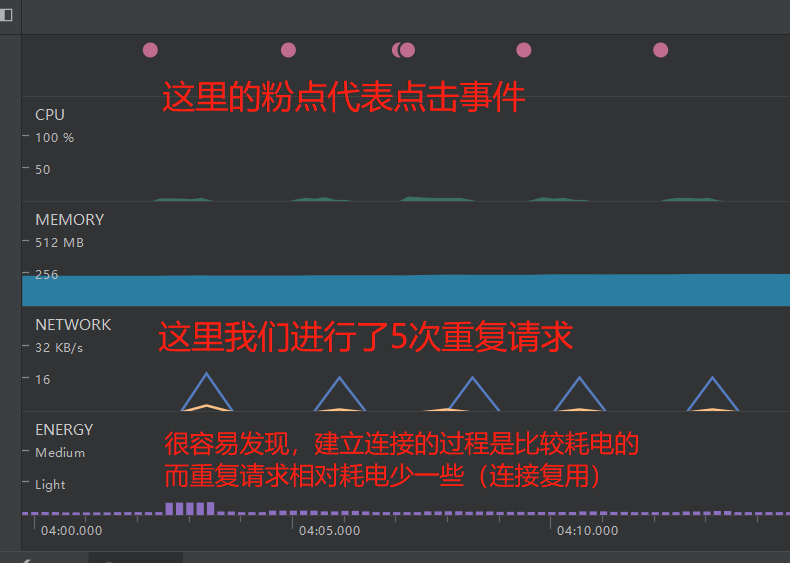
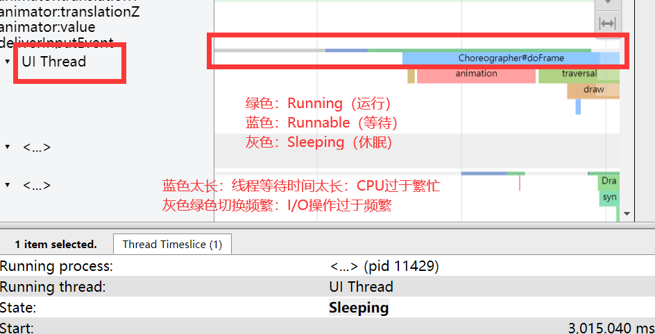
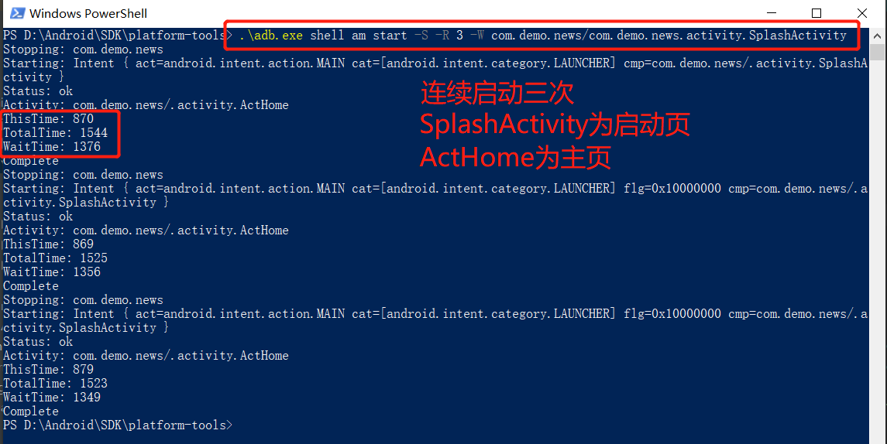

<font face="微软雅黑" >

# 性能优化
* 优化目的：更快、更稳定、更省
* 性能指标：流畅性、稳定性、资源节省性
* 优化方向：
（1）启动速度、页面显示与切换速度、相应速度
（2）避免出现崩溃Crash、无响应ANR、内存泄漏甚至溢出OOM
（3）节约内存、电量、网络流量，控制安装包大小

## 工具使用

#### AndroidProfiler
AndroidProfiler是SysTrace之后的一个新的性能分析工具，这个工具为我们概括了性能优化的四大内容，与上面的概括是异曲同工：
* [CUP](https://www.jianshu.com/p/7e9ca2c73c97) 实时监控CPU使用情况，并可查看某个时间段内CUP运行了什么线程，各线程中执行了什么方法，调用顺序以及执行时间
* [MEMORY](https://www.jianshu.com/p/20a2e7dad7eb) 实时查看内存使用情况，并可查看某个时间点的内存快照，可以看到有什么对象，以及对象被谁引用又引用了谁
* [NETWORK](https://developer.android.google.cn/studio/profile/network-profiler) 实时查看网络情况，可看到App的请求url、报文，用了多少流量、时间、请求返回状态、当前连接数等等
* [ENERGY](https://segmentfault.com/a/1190000021405871) 实时监测电量的使用，查找可能影响能耗的系统事件，包括唤醒锁、作业和闹钟。这个要8.0以上才能使用，8.0以下使用 [Battery Historian](https://www.jianshu.com/p/2f144bf7fe51)。

* 举个分析的例子（网络请求电量分析）：

以上四大模块分别可以点进去查看详情，大家可以自己试试。

#### Systrace
* AndroidProfiler并不能完全取代Systrace，我们要结合使用，[参考](https://www.jianshu.com/p/ea128ff16b24)
* [Systrace 官方指南](https://developer.android.google.cn/studio/profile/systrace.html)
* 使用举例：首先安装python2.7，然后从命令行界面进入Android SDK目录下的`platform-tools\systrace`目录，输入命令：（[命令语法参考](https://developer.android.google.cn/studio/profile/systrace/command-line)）
```
python systrace.py -t 10 -o C:\Users\YuChiTao\Desktop\trace.html sched gfx view am -a com.demo.news --no-compress
-t 执行时间；-o 输出位置；-a 指定应用
sched 显示任务名称；gfx Graphic系统的相关信息；view View绘制相关信息；am Activity Manager相关信息
--no-compress 不使用压缩（巨坑，花了好久时间才解决）
```
* 关键字推荐(category)
（1）测试列表滑动：gfx input view
（2）测试硬件加速（[HWUI](https://blog.csdn.net/wind_hzx/article/details/20307093)）:gfx input view hwui
（3）测试APP启动或进入某个界面的速度：gfx input view am wm res
（4）怀疑有GC或者IO导致的卡顿：gfx input view dalvik disk
（5）怀疑有power相关的问题：gfx input view res am wm power
<br>
* UI检测实例

具体颜色以及高级用法，请参考[官方解释](https://source.android.google.cn/devices/tech/debug/systrace)

* Systrace主要作用
（1）查看有无掉帧（Frames）
（2）埋点测试（AndroidProfiler做不到，一定要加-a参数）
（3）可以去抓竞品信息，分析对比自己的应用的不足

* 补充：Linux进程状态（对应stateWhenDescheduled字段）
D: 无法中断的休眠状态
R：正在可运行队列中的
S：休眠状态
T：停止
W：内存交换
X：死掉的进程
Z：僵尸进程

#### Lint
Analyze -> Inspect Code 静态代码检测

------

## 数据结构优化
* 注意各数据结构的恰当使用（ArrayList、HashMap、LinkedList等等）
* 数组查找快，增删慢；链表查找慢，增删快；数组空间连续，链表空间散落。
* Android 专用：SparseArray，比HashMap效率高很多。
* HashMap 是数组、链表、树的结合。

## 绘制优化
#### 布局
* 控制 xml 层级，使用检测工具：LayoutInspector
* 避免重复绘制，使用检测工具：手机自带 Profile GPU Rendering
* 可以通过使用自定义View减少层级以及View的数量
* 刷新View的时候，能部分刷新就部分刷新，减少绘制时间
* 使用.9图
* 使用ViewStub延迟加载，使用Merge减少层级（一般和include结合）
#### 动画
* 属性动画需要控制刷新频率（setFrameDelay，默认是10ms，也就是100帧每秒，[参考](https://www.cnblogs.com/fallblank/p/5604462.html)）
* 硬件加速虽然能使界面流畅，但是会使Bitmap的重用机制失效，并且耗电量增加、内存使用率增加。可以小范围使用，并且使用时打开，使用后关闭（LayerType设置为NONE）。
* Alpha动画会比较耗资源，少用


## 启动优化
#### 启动方式
* 冷启动：新启进程。
* 温启动：Activity被回收，进程还在，比如打开微信再打开淘宝，等了很久之后再回到微信，此时Activity可能已被回收，需要重启。
* 热启动：Activity、进程都存在，比如按下Home键，再启动应用。

#### 启动流程概括
* 加载App → <b>展示一个空Window</b> → 创建进程 → 创建Application → 启动MainThread → 创建MainActivity → 加载View → 布置屏幕 → 绘制 → 用MainActivity替换空Window。
* 需要关注的点：Application：attachBaseContext()、onCreate()；
Activity：onCreate()、style配置(背景等)、onStart()、onResume()、测量、布局、绘制

#### 主要问题及思考方向
* 问题：I/O操作、序列化/反序列化、网络操作、布局嵌套。
* 方向：去掉不必要的耗时操作，必要的耗时操作考虑以下策略：分布加载、异步加载、延期加载。

#### 通用启动优化方案：
（1）利用主题快速显示界面
（2）梳理业务流程，异步、延迟初始化组件，比如对三方SDK就行懒加载，不在 Application OnCreate() 时初始化，在真正用到的时候再去加载，[参考](https://www.jianshu.com/p/c821f1fb90d1)。
（3）不要在Application中创建线程池，开启线程池比单独开线程消耗大
（4）控制线程优先级，升高主线程优先级为MAX_PRIORITY（Thread中），或者降低子线程为THREAD_PRIORITY_BACKGROUND（Process中）
（4）减少MainActivity的View层级，减少绘制时间，可以考虑自定义View
（5）缓存可以缓存的网络请求，下次启动使用缓存数据
（6）不要在MainActivity中密集请求网络，可以考虑合并接口
（7）不要在在MainActivity中进行大量I/O操作，比如数据库操作

#### 检测启动时间：
```
adb shell am start -W [packageName]/[packageName.MainActivity]
adb shell am start -S -R 10 -W [packageName]/[packageName.MainActivity]
-S表示每次启动前先强行停止
-R表示重复测试次数
```

```
ThisTime: 870 //最后一个Activity的启动时间。
TotalTime: 1544 //应用的启动时间，包括创建进程+Application初始化+Activity初始化到界面显示。
WaitTime: 1376 //一般比TotalTime大点，包括系统影响的耗时（这里启动了两个Activity所以比TotalTime小）。
```

</font>
