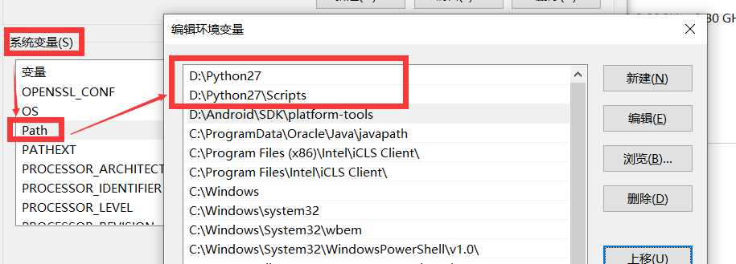
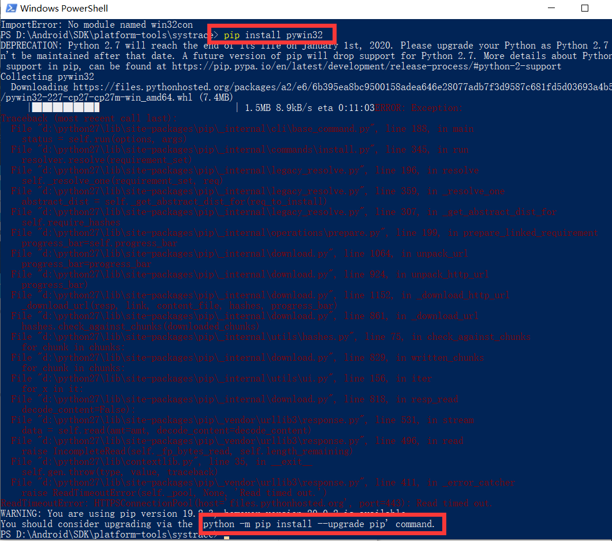
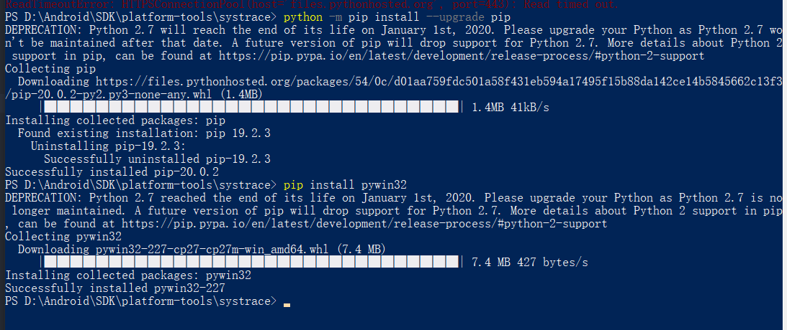
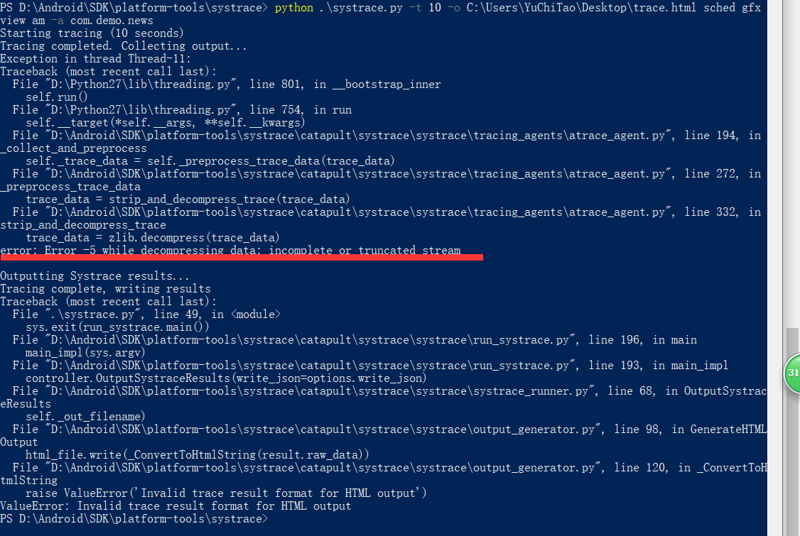
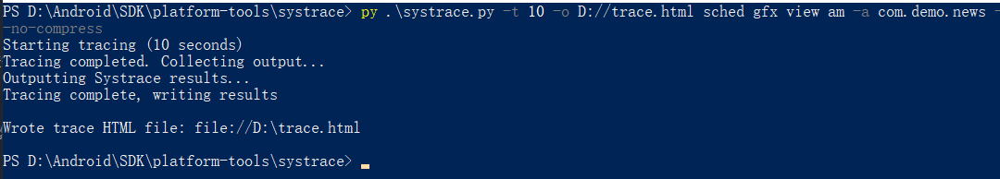

####环境变量配置
安装Python后注意环境变量配置：

务必把这两个配置移动到最前，不然win10的某些配置会使`pythone`关键字失效

####pywin32
安装pywin32，并且注意pip需要升级，如果有有代理的话就开代理，不然可能会报timeout
```
升级：python -m pip install --upgrade pip
安装：pip install ypwin32
```

成功安装的截图

至此，`pythone` 关键字已可以正常使用

####最后一个问题

[参考stackoverflow这个问题](https://stackoverflow.com/questions/48606877/systrace-output-error)：`systrace.py` has a --no-compress option. Using it should allow the trace to complete without hitting the failing decompression step.
```
 py .\systrace.py -t 10 -o D://trace.html sched gfx view am -a com.demo.news --no-compress
```
成功生成

